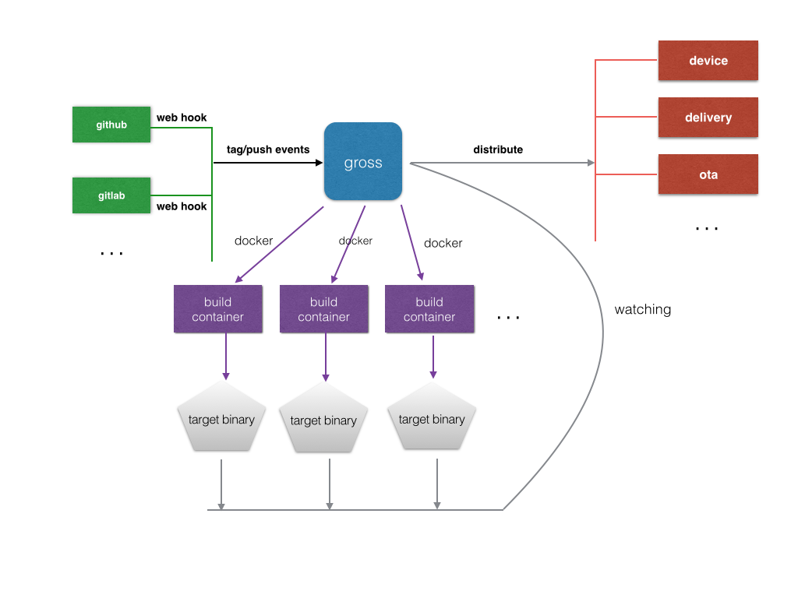

# gross    
gross is an auto cross compiling framework, which uses docker to build firmwares.

### purpose
Building cross compile toolchain for embeded development has always been annoying in traditional ways(may even cause days of efforts). And sometimes we found it hard to make the building progress automatic. We need a more flexible and unmanned firmware delivery pattern. 

### general ideas
So we create gross, with mechanism like below:

1. Use docker to hold firmware cross compile toolchain/sdk. This is a more lightweight aproach than the traditional virtual machine, and can invoke synchronized and isolated build tasks at a time.
2. Integrated into popular git based CVS platforms like github/gitlab. So the building and distributing process can be trigered automatically by source pushing or tagging.
3. The docker builds' output target bin can be discovered by gross. We use file watcher to detect folder changes, get the bin files, and notify the distributing process to handle the built firmware. 

### workflow overview

### container convention
1. A build.sh/build.bat script MUST exist in path /root/build.sh, which reads a bunch of params from command line. Gross will spawn the script in container with configured params.
2. Make sure the build image has access right to the CVS repo source(You may need to configure a deploy key in the project source).
3. The build container SHOULD expose a shared folder to the gross host. Gross will watch the folder for built target.
4. Typical build script workflow is like below:
	a. clone the repo from cvs
	b. read params from command line
	c. invoke a build command with params specified(eg. "make foo=xx bar=xx")
	d. if build success, copy the target binary to shared folder
	
### usage
TODO
